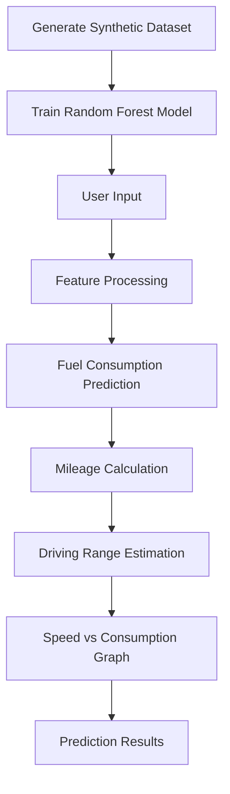

<div align="center">

# PINNFuel

Machine Learning-Based Fuel Consumption Prediction System

A Python application that predicts fuel consumption, mileage efficiency, and driving range using a Random Forest regression model trained on realistic synthetic driving scenarios.

<p align="center">


</p>

</div>


## Overview

PINNFuel is a machine learning application that estimates vehicle fuel consumption based on engine specifications, driving conditions, environmental factors, and vehicle characteristics.

The system predicts:

- Fuel Consumption (L/100 km)
- Mileage Efficiency (km/L)
- Maximum Driving Range
- Speed vs Fuel Consumption Curve

The prediction model is trained using **8,000 synthetic driving scenarios** generated from realistic vehicle physics.


## Features

- Random Forest Regression Model
- Engine CC-Based Consumption Modeling
- Vehicle-Specific Physics
- Aerodynamic Speed Analysis
- Traffic Condition Adjustment
- Tire Pressure Effects
- Vehicle Age Degradation
- Load Impact Calculation
- Fuel Range Estimation
- Consumption Visualization


## Technology Stack

| Technology | Purpose |
|------------|---------|
| Python | Core Programming Language |
| Scikit-Learn | Machine Learning |
| NumPy | Numerical Computation |
| Matplotlib | Data Visualization |


## Architecture




## Project Structure

```text
PINNFuel/

├── app.py
├── requirements.txt
└── README.md
```


## Installation

Clone the repository

```bash
git clone https://github.com/yourusername/PINNFuel.git

cd PINNFuel
```

Install dependencies

```bash
pip install -r requirements.txt
```

Run

```bash
python app.py
```


## User Inputs

| Parameter | Range |
|-----------|-------|
| Vehicle Type | Hatchback, Sedan, SUV, Pickup, Van, Motorcycle |
| Engine Capacity | 50–6000 cc |
| Speed | 10–160 km/h |
| Load | Vehicle Dependent |
| Air Conditioning | Cars Only |
| Tire Pressure | Vehicle Dependent |
| Vehicle Age | 0–40 Years |
| Traffic | Light, Moderate, Heavy |
| Fuel Available | 0.5–200 L |


## Supported Vehicles

| Vehicle | Engine Range |
|----------|-------------:|
| Hatchback | 800–2000 cc |
| Sedan | 1200–3500 cc |
| SUV | 1500–5000 cc |
| Pickup | 2000–6000 cc |
| Van | 1500–4000 cc |
| Motorcycle | 50–1800 cc |


## Machine Learning Model

| Property | Value |
|----------|-------|
| Algorithm | Random Forest Regressor |
| Estimators | 100 |
| Training Samples | 8,000 |
| Target Variable | Fuel Consumption |
| Output Metrics | Fuel Consumption, Mileage, Driving Range |


## Sample Output

```text
Vehicle Type            Sedan

Engine Capacity         2000 cc

Average Speed           80 km/h

Estimated Consumption   6.84 L/100 km

Mileage                 14.62 km/L

Maximum Range           877.2 km
```


## Future Enhancements

- Real-world OBD-II Data Integration
- Deep Learning Regression Models
- Carbon Emission Prediction
- Fuel Cost Estimation
- Weather-Based Consumption Analysis
- REST API
- Streamlit Dashboard
- Docker Deployment


## License

This project is licensed under the MIT License.


## Contact

<p align="left">
<a href="mailto:shyam.m.pillai71@gmail.com">

</a>

<a href="https://linkedin.com/in/shyampillai07">

</a>
</p>

For questions, feedback, or collaboration opportunities, feel free to reach out.
